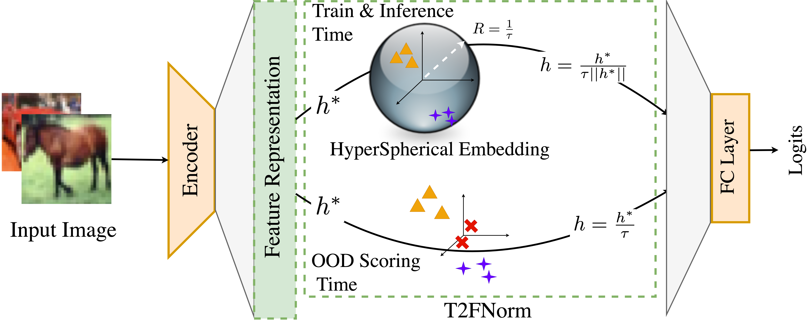

# T2FNorm: Train-time Feature Normalization for OOD Detection in Image Classification
This codebase provides a Pytorch implementation of:

>**T2FNorm: Train-time Feature Normalization for OOD Detection in Image Classification.**  
[](https://arxiv.org/abs/2305.17797)  
Sudarshan Regmi, Bibek Panthi, Sakar Dotel, Prashnna K. Gyawali, Danail Stoyanov, Binod Bhattarai

## Abstract
Neural networks are notorious for being overconfident predictors, posing a significant challenge to their safe deployment in real-world applications. While feature normalization has garnered considerable attention within the deep learning literature, current train-time regularization methods for Out-of-Distribution(OOD) detection are yet to fully exploit this potential. Indeed, the naive incorporation of feature normalization within neural networks does not guarantee substantial improvement in OOD detection performance. In this work, we introduce T2FNorm, a novel approach to transforming features to hyperspherical space during training, while employing non-transformed space for OOD-scoring purposes. This method yields a surprising enhancement in OOD detection capabilities without compromising model accuracy in in-distribution(ID). Our investigation demonstrates that the proposed technique substantially diminishes the norm of the features of all samples, more so in the case of out-of-distribution samples, thereby addressing the prevalent concern of overconfidence in neural networks. The proposed method also significantly improves various post-hoc OOD detection methods.

## T2FNorm highlights in OpenOODv1.5 [leaderboard](https://zjysteven.github.io/OpenOOD/) 
➤ **ranks 4th** in the *far-OOD AUROC* metric on CIFAR10 datasets.  
➤ **ranks 8th** in the *far-OOD AUROC* metric on CIFAR100 datasets.  
➤ **ranks 9th** in the *far-OOD AUROC* metric on ImageNet200 datasets  (OOD).  
➤ **ranks 5th** in the *far-OOD AUROC* metric on ImageNet200 datasets (FSOOD).


### Follow [OpenOOD](https://github.com/Jingkang50/OpenOOD) official instruction to complete the setup.
```
pip install git+https://github.com/Jingkang50/OpenOOD
```

### T2FNorm Illustration
<p align="center">
  
</p>

### Example Scripts for Training and Inference
Use the following scripts for training and inferencing the model trained with T2FNorm regularization on different datasets:

- **CIFAR-10:**
  ```bash
  bash scripts/ood/t2fnorm/cifar10_train_t2fnorm.sh
  bash scripts/ood/t2fnorm/cifar10_test_t2fnorm.sh
  ```
- **CIFAR-100:**
  ```bash
  bash scripts/ood/t2fnorm/cifar100_train_t2fnorm.sh
  bash scripts/ood/t2fnorm/cifar100_test_t2fnorm.sh
  ```
- **ImageNet-200:**
  ```bash
  bash scripts/ood/t2fnorm/imagenet200_train_t2fnorm.sh
  bash scripts/ood/t2fnorm/imagenet200_test_t2fnorm.sh
  ```
- **ImageNet-1k:**
  ```bash
  bash scripts/ood/t2fnorm/imagenet_train_t2fnorm.sh
  bash scripts/ood/t2fnorm/imagenet_test_t2fnorm.sh
  ```

### Pre-trained checkpoints
Pre-trained models are available in the given links:
- CIFAR-10 [[Google Drive]](https://drive.google.com/file/d/1FchVmaDodfsSE-eyA6FjnEZ7FtFm0v4u/view?usp=sharing): ResNet-18 classifiers trained on CIFAR-10 datasets with T2FNorm regularization across 3 trials.
- CIFAR-100 [[Google Drive]](https://drive.google.com/file/d/16bEDcPPjPkt4KmnqurfGnI6gPLIwZJc8/view?usp=sharing): ResNet-18 classifiers trained on CIFAR-100 datasets with T2FNorm regularization across 3 trials.
- ImageNet-200 [[Google Drive]](https://drive.google.com/file/d/1i6Rsb11yr0cP6grjtyQI23sYfSH3fBBH/view?usp=sharing): ResNet-18 classifiers trained on ImageNet-200 datasets with T2FNorm regularization across 3 trials.
- ImageNet-1k [[Google Drive]](https://drive.google.com/file/d/1vEfGSg0sIONLYu2XXxWixRAtE5YYVeUw/view?usp=drive_link): ResNet-50 classifier trained on ImageNet-1k datasets with T2FNorm regularization across 1 trial.

The inference scripts for T2FNorm currently utilize the T2FNorm postprocessor (MSP with scaled feature). However, T2FNorm is compatible with various types of postprocessors.

### Results

- CIFAR-10 (OOD):

|   datasets   | FPR@95       | AUROC        | AUPR_IN      | AUPR_OUT     | ACC          |
|:-------------|:-------------|:-------------|:-------------|:-------------|:-------------|
| cifar100     | 30.60 ± 0.45 | 91.56 ± 0.10 | 92.31 ± 0.06 | 90.20 ± 0.16 | 94.69 ± 0.07 |
| tin          | 22.33 ± 0.37 | 94.02 ± 0.16 | 95.47 ± 0.11 | 91.91 ± 0.28 | 94.69 ± 0.07 |
| nearood      | 26.47 ± 0.35 | 92.79 ± 0.13 | 93.89 ± 0.08 | 91.06 ± 0.22 | 94.69 ± 0.07 |
| mnist        | 3.50 ± 1.33  | 99.28 ± 0.27 | 97.01 ± 1.02 | 99.89 ± 0.04 | 94.69 ± 0.07 |
| svhn         | 5.72 ± 0.66  | 98.81 ± 0.22 | 97.47 ± 0.36 | 99.54 ± 0.10 | 94.69 ± 0.07 |
| texture      | 19.49 ± 2.58 | 95.44 ± 0.77 | 97.17 ± 0.49 | 92.85 ± 1.23 | 94.69 ± 0.07 |
| places365    | 22.27 ± 1.28 | 94.40 ± 0.32 | 87.48 ± 0.76 | 98.17 ± 0.10 | 94.69 ± 0.07 |
| farood       | 12.75 ± 0.73 | 96.98 ± 0.23 | 94.79 ± 0.22 | 97.61 ± 0.33 | 94.69 ± 0.07 |

- CIFAR-100 (OOD):

|   datasets   | FPR@95       | AUROC        | AUPR_IN      | AUPR_OUT     | ACC          |
|:-------------|:-------------|:-------------|:-------------|:-------------|:-------------|
| cifar10      | 67.07 ± 1.90 | 76.09 ± 0.81 | 76.13 ± 1.04 | 73.38 ± 0.80 | 76.43 ± 0.13 |
| tin          | 49.88 ± 0.85 | 83.59 ± 0.02 | 88.82 ± 0.04 | 74.02 ± 0.27 | 76.43 ± 0.13 |
| nearood      | 58.47 ± 1.35 | 79.84 ± 0.40 | 82.48 ± 0.53 | 73.70 ± 0.40 | 76.43 ± 0.13 |
| mnist        | 39.39 ± 5.38 | 86.22 ± 2.29 | 68.13 ± 4.37 | 97.13 ± 0.47 | 76.43 ± 0.13 |
| svhn         | 44.29 ± 3.14 | 86.04 ± 1.04 | 76.98 ± 1.89 | 92.87 ± 0.51 | 76.43 ± 0.13 |
| texture      | 66.82 ± 4.61 | 77.32 ± 1.63 | 84.54 ± 1.52 | 64.15 ± 1.83 | 76.43 ± 0.13 |
| places365    | 54.50 ± 0.52 | 81.35 ± 0.33 | 64.83 ± 0.66 | 92.41 ± 0.13 | 76.43 ± 0.13 |
| farood       | 51.25 ± 2.52 | 82.73 ± 1.01 | 73.62 ± 1.57 | 86.64 ± 0.62 | 76.43 ± 0.13 |

- ImageNet-200 (OOD):

|   datasets   | FPR@95       | AUROC        | AUPR_IN      | AUPR_OUT     | ACC          |
|:-------------|:-------------|:-------------|:-------------|:-------------|:-------------|
| ssb_hard     | 65.94 ± 0.27 | 79.00 ± 0.16 | 45.76 ± 0.45 | 94.26 ± 0.05 | 86.87 ± 0.19 |
| ninco        | 44.09 ± 0.79 | 86.99 ± 0.02 | 91.74 ± 0.07 | 79.03 ± 0.19 | 86.87 ± 0.19 |
| nearood      | 55.01 ± 0.36 | 83.00 ± 0.07 | 68.75 ± 0.25 | 86.64 ± 0.10 | 86.87 ± 0.19 |
| inaturalist  | 13.47 ± 0.76 | 96.87 ± 0.13 | 97.09 ± 0.14 | 96.82 ± 0.10 | 86.87 ± 0.19 |
| textures     | 33.46 ± 0.34 | 91.95 ± 0.20 | 94.43 ± 0.18 | 87.57 ± 0.36 | 86.87 ± 0.19 |
| openimage_o  | 29.17 ± 0.69 | 91.81 ± 0.19 | 89.31 ± 0.24 | 94.21 ± 0.14 | 86.87 ± 0.19 |
| farood       | 25.37 ± 0.55 | 93.55 ± 0.17 | 93.61 ± 0.18 | 92.87 ± 0.20 | 86.87 ± 0.19 |

- ImageNet-200 (FSOOD):

|   datasets   | FPR@95       | AUROC        | AUPR_IN      | AUPR_OUT     | ACC          |
|:-------------|:-------------|:-------------|:-------------|:-------------|:-------------|
| ssb_hard     | 89.35 ± 0.09 | 46.13 ± 0.36 | 49.11 ± 0.25 | 48.42 ± 0.26 | 45.00 ± 0.23 |
| ninco        | 80.45 ± 0.38 | 57.63 ± 0.13 | 91.82 ± 0.06 | 14.00 ± 0.09 | 45.00 ± 0.23 |
| nearood      | 84.90 ± 0.17 | 51.88 ± 0.23 | 70.47 ± 0.14 | 31.21 ± 0.16 | 45.00 ± 0.23 |
| inaturalist  | 55.99 ± 1.28 | 82.36 ± 0.25 | 95.24 ± 0.11 | 50.99 ± 1.07 | 45.00 ± 0.23 |
| textures     | 74.81 ± 0.38 | 71.22 ± 0.35 | 94.99 ± 0.09 | 25.00 ± 1.37 | 45.00 ± 0.23 |
| openimage_o  | 72.07 ± 0.51 | 67.02 ± 0.39 | 85.90 ± 0.20 | 39.56 ± 0.10 | 45.00 ± 0.23 |
| farood       | 67.62 ± 0.70 | 73.53 ± 0.30 | 92.04 ± 0.13 | 38.51 ± 0.82 | 45.00 ± 0.23 |

- ImageNet-1k (OOD):

|   datasets   |   FPR@95 |   AUROC |   AUPR_IN |   AUPR_OUT |   ACC |
|:-------------|---------:|--------:|----------:|-----------:|------:|
| ssb_hard     |    81.68 |   65.91 |     64.86 |      65.15 | 76.76 |
| ninco        |    56.6  |   80.25 |     96.9  |      31.83 | 76.76 |
| nearood      |    69.14 |   73.08 |     80.88 |      48.49 | 76.76 |
| inaturalist  |    20.65 |   94.87 |     98.8  |      80.6  | 76.76 |
| textures     |    38.22 |   90.53 |     98.61 |      60.46 | 76.76 |
| openimage_o  |    34.86 |   90.35 |     96.43 |      75.01 | 76.76 |
| farood       |    31.24 |   91.92 |     97.95 |      72.02 | 76.76 |

- ImageNet-1k (FSOOD):

|   datasets   |   FPR@95 |   AUROC |   AUPR_IN |   AUPR_OUT |   ACC |
|:-------------|---------:|--------:|----------:|-----------:|------:|
| ssb_hard     |    89.28 |   47.99 |     68.75 |      30.49 | 55.27 |
| ninco        |    73.1  |   61.74 |     96.77 |       6.98 | 55.27 |
| nearood      |    81.19 |   54.86 |     82.76 |      18.73 | 55.27 |
| inaturalist  |    44.12 |   83.25 |     97.99 |      28.27 | 55.27 |
| textures     |    59.75 |   77.19 |     98.36 |      14.4  | 55.27 |
| openimage_o  |    57.1  |   75.12 |     95.17 |      26.15 | 55.27 |
| farood       |    53.66 |   78.52 |     97.18 |      22.94 | 55.27 |

### Please consider citing our work if you find it useful.
```
@misc{regmi2023t2fnorm,
      title={T2FNorm: Extremely Simple Scaled Train-time Feature Normalization for OOD Detection}, 
      author={Sudarshan Regmi and Bibek Panthi and Sakar Dotel and Prashnna K. Gyawali and Danail Stoyanov and Binod Bhattarai},
      year={2023},
      eprint={2305.17797},
      archivePrefix={arXiv},
      primaryClass={cs.CV}
}
```
### Acknowledgment
This codebase builds upon [OpenOOD](https://github.com/Jingkang50/OpenOOD).
